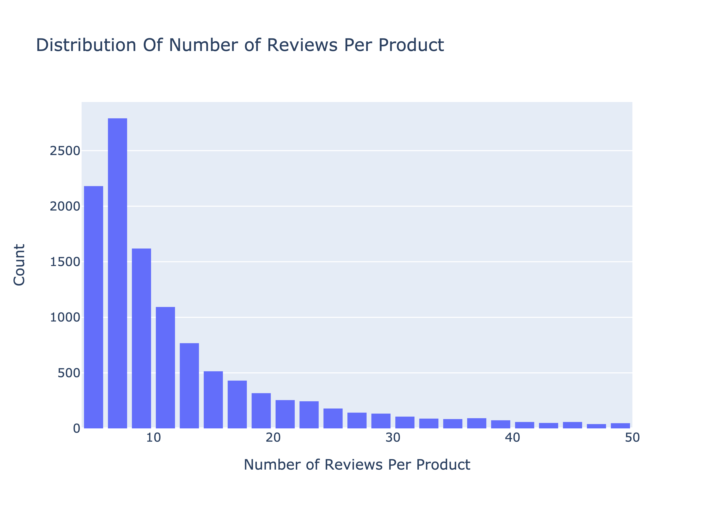

# Recommendation-Systems for Amazon Beauty Products
Authors: Margaret Boland, Jillian Clark, and Alex FitzGerald

## Overview
This project aims to create a recommendation system for the Amazon marketing team to utilize to send targeted recommendation e-mails to users who have purchased and rated products within 30 days. A collaborative approach was taken, meaning recommendations will be made by comparing similar reviewer profiles based on existing ratings. 

## Business Problem

## Data Understanding and Preparation
Data for this project was pulled from a compiled dataset of Amazon Beauty product reviews and meta data in two seperate JSON files. The datasets can be found here (LINK TO SITE). We utlized the smaller dataset known as 5-core which contained data for products and reviewers with at least 5 entries. 

Our review data contained 198,502 reviews from 22,363 reviewers. The reviews spanned across 12,101 unique products. Reviews ranged on a scale of 1-5. A majority of reviews received an overall review of 5, which could be a limitation to our model. 


A majority of our ratings received under 10 ratings.



A majority of our users rated under 10 products.


Our Meta Data contained 259,204 unique products. 

Our data did not require much cleaning. We selected the appropriate columns of our model to utilize for surprise, which included 'reviewerID', 'asin', and 'overall'. This data contained our unique reviewer ID, unique product ID, and overall rating on a scale of 1-5.

## Methods

We utilized a Normal Predictor model for our initial model.

## Final Collaborative Filtering Models
Model that returns recommendations across all categories vs being able to select category.

Our final model allows us to input the unique reviewerID and number of recommendations we would like the model to return. The model then returns the requested number of items, including the ASIN, Product Name, Description, and Image.


Our additional final model allows us to input the unique reviewerID, the number of recommendations we would like the model to return, and the category of product we would like our recommended products to be. The model then returns the requested number of items, including the ASIN, Product Name, Description, and Image.


## Conclusion

## Next Steps

## Repository Structure
```
├── data
│   ├── meta_Beauty.json.gz
│   ├── reviews_Beauty_5.json.gz
├── images
│   ├── recommended_fragrance_products.png
│   ├── recommended_products.png
│   ├── reviews_distribution.png
│   ├── reviews_per_product.png
│   ├── reviews_per_user.png
├── working_notebooks
│   ├── review_data
│   ├── meta_data
├── .gitignore
├── LICENSE.md
├── README.md
├── notebook.pdf
├── presentation.pdf
└── student.ipynb
```
