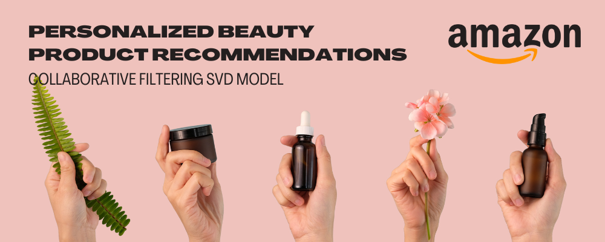
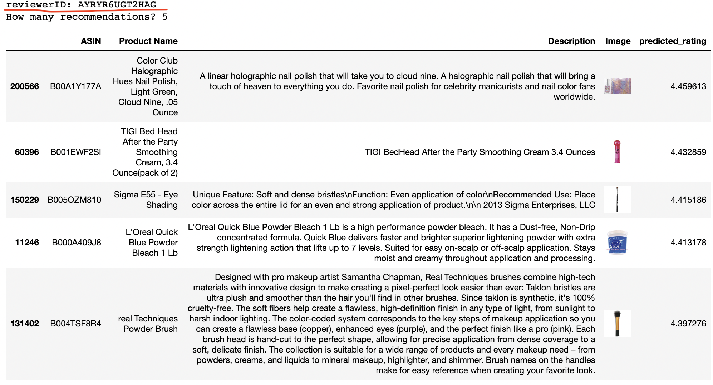
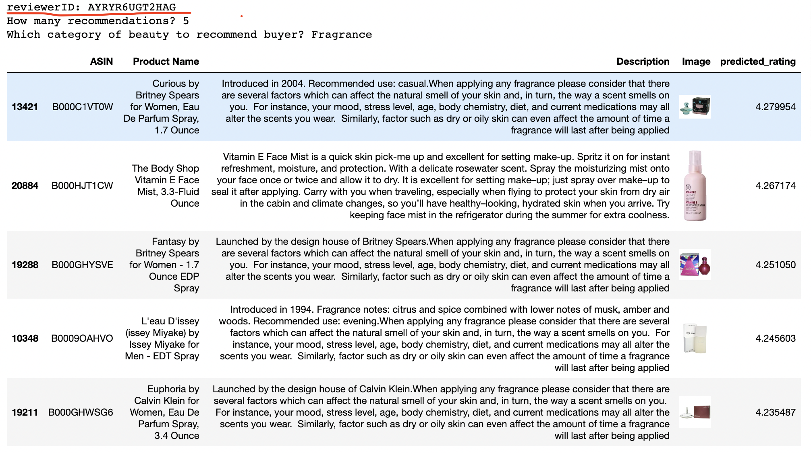

# Recommendation-Systems for Amazon Beauty Products
Authors: Margaret Boland, Jillian Clark, and Alex FitzGerald

## Overview
For the purpose of this project, we are a team of internal data scientists at Amazon. This project aims to create a recommendation system for the Amazon marketing team to utilize to send targeted recommendation e-mails to users who have purchased and rated products within 30 days. A collaborative approach was taken, meaning recommendations will be made by comparing similar reviewer profiles based on existing ratings. 

## Business Problem
Amazon's marketing team for beauty products has recognized a big opportunity to improve the emails they send to customers following a purchase. Customers open these post-purchase emails [17% more often](https://www.klaviyo.com/blog/post-purchase-emails) than other types of automated emails. In addition to the visibility of post-purchase emails, their timing is critically important in the lifecyle of a customer. Succesfully re-engaging a customer at the post-purchase stage places them back into a consideration stage which will eventually lead to future purchases, increasing the customer's purchase frequency and lifetime value. However, re-engagment depends on these emails featuring content that customers want to engage with.

To help improve the engagment with their post-purchase emails, Amazon's beauty marketing team has pulled in an internal group of data scientists to create a recommendation system that will select personalized product recommendations for customers to include in post-purchase emails. Succesfull product recommendations must be personalized, relevant, and timely. Personalized in that they accurately predict products a given customer will enjoy, relevant because they don't recommend products the customer just purchased, and timely becuase they have the ability to tailor recommendations to seasonal events.

## Data Understanding and Preparation
Data for this project was pulled from a compiled dataset of Amazon Beauty product reviews and meta data in two seperate JSON files. The datasets can be found [here](http://jmcauley.ucsd.edu/data/amazon/links.html). We utlized the smaller dataset known as 5-core which contained data for products and reviewers with at least 5 entries. 

Our review data contained 198,502 reviews from 22,363 reviewers. The reviews spanned across 12,101 unique products. Reviews ranged on a scale of 1-5. A majority of reviews received an overall review of 5, which could be a limitation to our model. 


Here we see a distribution of the number of reviews each product has received. A majority of our ratings received under 10 ratings.


Here we see a distribution of the number of reviews each user has completed. We see a majority of our users rated under 10 products.


Our Meta Data contained 259,204 unique products. We looked further into the Beauty subcategories to create a recommendation system to return items specifically in that subcategory. We found that the six subcategories related to Beauty are: Skin Care', 'Tools & Accessories', 'Makeup', 'Hair Care', 'Bath & Body', and 'Fragrance'.

Our data did not require much cleaning. We selected the appropriate columns of our model to utilize for surprise, which included 'reviewerID', 'asin', and 'overall'. This data contained our unique reviewer ID, unique product ID, and overall rating on a scale of 1-5.

## Methods

We utilized a Normal Predictor model for our initial model, which returned an RMSE of 1.5. We iterated through the following model algorithms to assess which models to further explore: SVD(), SVDpp(), SlopeOne(), NMF(), NormalPredictor(), KNNBaseline(), KNNBasic(), KNNWithMeans(), KNNWithZScore(), BaselineOnly(), and CoClustering(). Our results were based on cross validation and returning the RMSE for each model, along with the fit time and test time. The top 3 models according to Test RMSE were SVDpp, SVD, and Baseline Only. Based on these results, we chose those 3 models to explore further.

We ran multiple grid searchs to test hyperparameters for SVDpp and SVD. Our best model based on RMSE was an SVD model with the following paramenters specified: (n_factors=2, n_epochs=20, biased=True).


## Final Collaborative Filtering Models

Our final model allows us to input the unique reviewerID and number of recommendations we would like the model to return. The model then returns the requested number of items, including the ASIN, Product Name, Description, Image, and predicted_rating. Recommended products are ordered from the highest predicted_rating to the lowest.



Our additional final model allows us to input the unique reviewerID, the number of recommendations we would like the model to return, and the category of product we would like our recommended products to be. The model then returns the requested number of items, including the ASIN, Product Name, Description, and Image. This will be especially helpful when trying to promote certain items at certain times of year, like Fragrances around Valentine's Day or Skin Care products in the winter time. 



## Final Model Evaluation
The final recommendation model using  SVD yielded a RMSE of XX meaning that, on average, our predicted review scores for Amazon buyers were XX points off of the true value of review scores. This score is more than half a point drop from our baseline model. On a review scale of 1- 5, we believe that is a significant improvement. 

The model also has other features that greatly improves the personalization of a post-purchase marketing email: 
- No repeat products. The model will not recommend items that the buyer has already purchased. This helps improve product discoverability. 
- Prioritizes the best match for the buyer. Whether the model is recommended through the catalog of products, or through a sub category, it will always deliver N number of the top predicted reviews for a buyer. 
- Subcategory filtering. The model allows for filtering beauty products based on six subcategories, allowing a more refined search. 
- Image retrieval. The model converts the URL to an image and delivers this image alongside recommended titles and descriptions.

## Limitations and Next Steps
While our model optimizes for minimizing the RMSE of predicted reviews, it has its limitations. First, our dataset was skewed towards higher ratings as nearly 60% of all reviews were rated 5 points. This in turn skews our predicted values higher. While this may not matter when grabbing the highest rated products, it certainly would affect our lower rated items. We suggest looking into whether these high ratings are a product of the dataset we used, or are consistent with Amazon buyer behavior. 

Secondly,  our model does not handle indiscriminate reviewers - or reviewers who rate all products the same. This means that our model does not capture their preferences well. We suggest a separate survey be sent to these buyers post-purchase in an effort to determine their preferences. We could then find a way to incorporate these preferences in a future model. 

Third, our model does not address the cold start problem. Our model needs prior reviews from users in order to offer recommendations. Next steps would be to add a content-based approad to address this problem.

Finally, we noticed that the dataset often miscategorizes products in their subcategories (haircare, skincare, etc.), which can lead our subcategory predictor to recommend misclassified products. We recommend implementing a standardized classification of subcategories when new products are added to the marketplace. 

## Conclusion

The Amazon marketing team can implement our recommendation tools quickly and with ease in order to offer more individualized recommendations for users. This will increase user engagement and user purchases. Our model can also be used to market certain types of products that may be popular seasonally, such as sending out individualized Skin Care recommendations in the winter time/dry season, or Fragrance recommendations around gift-giving occassions such as Valentine's Day.

## Repository Structure
```
├── Data
│   ├── meta_Beauty.json.gz
│   ├── reviews_Beauty_5.json.gz
├── images
│   ├── recommended_fragrance_products.png
│   ├── recommended_products.png
│   ├── reviews_distribution.png
│   ├── reviews_per_product.png
│   ├── reviews_per_user.png
├── working_notebooks
│   ├── Alex_notebook_2.ipynb
│   ├── Alex_notebook_metadata.ipynb
│   ├── jillian_notebook.ipynb
│   ├── meg_notebook.ipynb
├── .gitignore
├── LICENSE
├── README.md
├── final_notebook.ipynb
├── presentation.pdf
└── final_notebook.pdf
```
